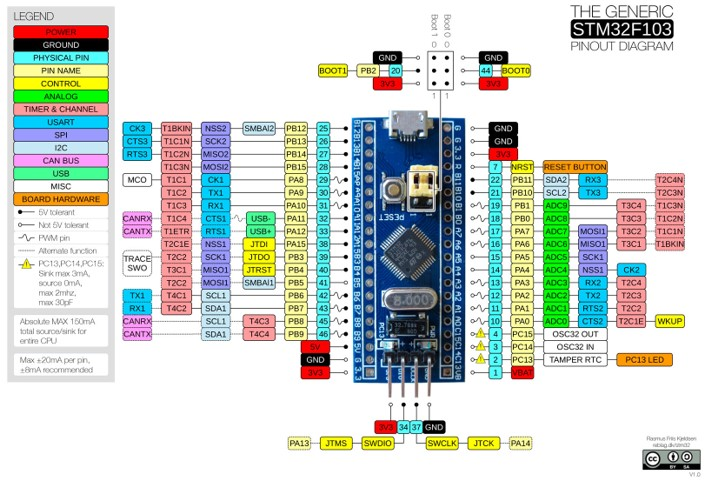

# Parametry z eshopu

## Detailní popis produktu

Jedná se o klon mikrokontroleru STM32F103 - CS32F103 signatura CPUTAPID 0x2ba01477. Z tohoto důvodu nebude možné používat originální GDB debugger. Čip může být označen buď CS32F103, nebo STM32F103.

Řada mikrokontrolerů STM32F103xx obsahuje vysoce výkonné 32-bitové jádro RISC ARM®Cortex®-M3 pracující s frekvencí až 72 MHz, vysokorychlostní vestavěné paměti (paměť Flash až 128 kB a SRAM až 20 kB), bohatý počet vylepšených I/O portů a periferií připojených ke dvěma sběrnicím APB. Mikrokontrolery nabízejí dva 12bitové ADC převodníky, tři univerzální 16bitové časovače plus jeden PWM časovač, jakož i standardní a pokročilá komunikační rozhraní: až dvě I2C a SPI, tři USART, USB a CAN.

Díky těmto vlastnostem je řada mikrokontrolerů STM32F103xx vhodná pro širokou škálu aplikací, jako jsou motorové pohony, řízení aplikací, lékařské a ruční přístroje, PC a herní periferie, platformy GPS, průmyslové aplikace, PLC, invertory, tiskárny, skenery, poplašné systémy, videotelefony a další.

Tato vývojová deska je svým výběrem konkrétních součástek a kompaktními rozměry velice vhodná pro začátečníky, kteří hledají výkonnější alternativu k vývojové desce Arduino Nano. Pro tuto desku je dostupných několik vývojových prostředí včetně Arduino IDE. Pro naprogramování desky lze použít programátor ST-Link V2 (popř. jeho klon), nebo USART Bootloader.

## Specifikace

- Mikrokontroler STM32F103C8 (klon)
- Frekvence CPU až 72MHz
- FLASH 64KB
- SRAM 20KB
- 2 x 12bit ADC (0 – 3.6V, 16 kanálů)
- 7 x DMA
- 7 x časovač:
  - 3 x 16bit časovač, každý s až 4 vstupy IC/OC/PWM nebo čítačem impulzů a kvadraturním (inkrementálním) vstupem pro enkodér
  - 16bitový časovač PWM s řízením motoru s generováním mrtvé doby (dead-time) a nouzovým zastavením
  - 2 x Watchdog časovač (Independent a Window)
  - 24bit SysTick časovač
- 2 x I2C (SMBus/PMBus)
- 3 x USART (ISO 7816 interface, LIN, IrDA, modem control)
- 2 x SPI (18 Mbit/s)
- 1 x CAN (2.0B Active)
- 1 x USB 2.0 full-speed
- 1 x obvod reálného času - RTC
- CRC calculation unit, 96-bit unikátní ID
- Oscilátory, reset a správa napájení:
  - Napájení 2.0 - 3.6 V
  - Reset při zapnutí napájení (Power-on Reset), reset při vypnutí napájení (Power-down Reset) a programovatelný detektor napětí (PVD)
  - Externí 4 - 16 MHz oscilátor pro CPU
  - Interní 8 MHz oscilátor pro CPU
  - Interní 40 kHz oscilátor pro RTC
  - PLL pro taktování CPU
  - Externí 32.768 kHz oscilátor s kalibrací pro RTC
- Režim nízké spotřeby:
- Sleep, Stop a Standby režim
  - VBAT vstup pro zálohování napájení pro RTC a záložní registry

## Vývojová deska

- Rozměry desky 53mm x 22mm. Rozteč pinů odpovídá standartnímu 40pin DIP pouzdru – breadboard friendly
- Na desce jsou kromě mikrokontroleru integrovány tyto komponenty:
  - Zdroj 3.3V 300mA
  - Krystal 8MHz pro CPU
  - Krystal 32.768kHz pro RTC
  - Propojky volby způsobu programování – BOOT0 a BOOT1
  - Resetovací tlačítko
  - Mikro USB konektor – napájení a data
  - SWD konektor – programování a debugging pomocí programátoru ST-Link V2
  - LED indikující 3.3V napájení
  - LED propojená na pin PC13
- Desku lze napájet pomocí Mikro USB konektoru, nebo napájecích pinů

## Zapojení vývodů

## Součásti dodávky

- 1ks Klon BluePill ARM STM32 STM32F103C8 Vývojová deska
- 2ks 20pin oboustranná kolíková lišta
