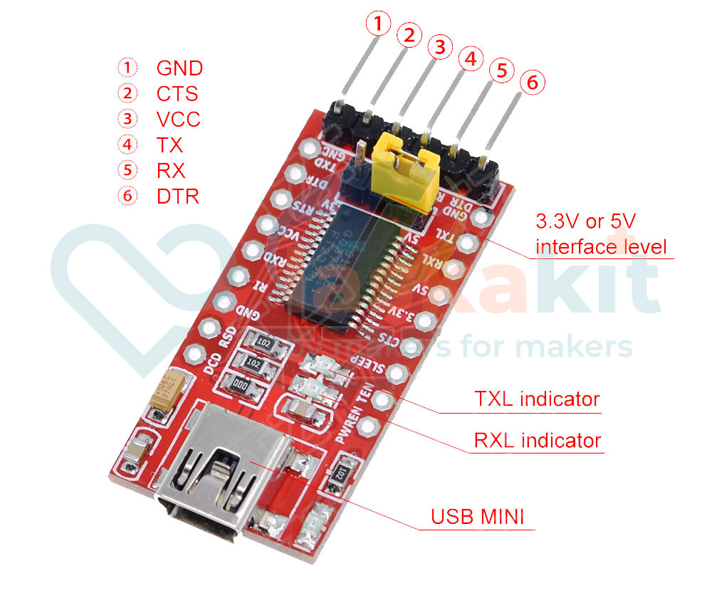

# Detailní popis produktu

Převodník úrovní slouží ke komunikaci mezi PC a zařízením s UART. Využijete jej například pro programování Arduino bez USB portu.

## Specifikace

- Chip: FT232RL
- Definice pinů: DTR, RXD, TX, VCC, CTS, GND
- Podpora: USB 1.0 a 2.0
- Rozhraní: 3.3 a 5V
- Rozměry: 36×19mm
- Rozhraní: Mini USB

## Součásti dodávky

1ks Převodník USB TTL UART, FT232RL, DTR pin

## Drivery

- [COM](https://ftdichip.com/drivers/vcp-drivers/)
- [D2XX](https://ftdichip.com/drivers/d2xx-drivers/)
